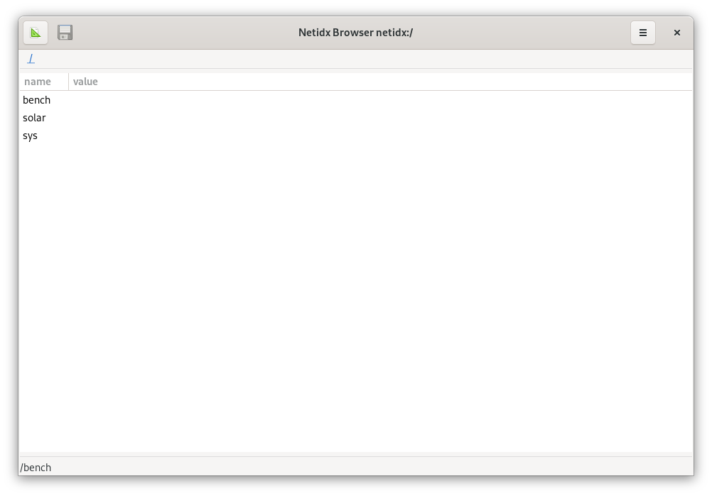
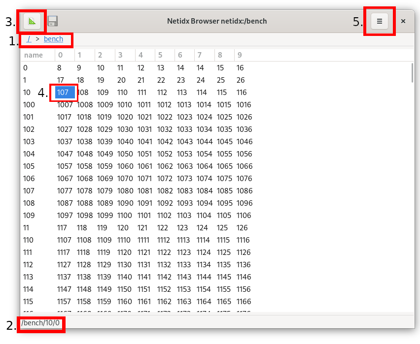

# Browser

The browser is a graphical tool that visualizes the contents of
netidx, it allows users to navigate to places of interest, view data
in tabular or vector form, and construct applications with custom
views and BScript.

Depending on the structure of a subtree the browser draws either a
vector,



or a table,



The various components highlighted in red are,

1. The path of the currently visualized subtree. To navigate, you can
   click on any of the individual components, e.g. click the `/` to
   navigate to the root, and you can refresh the current view by
   clicking the link to the current path, `bench` in this case. If
   you're viewing a custom view stored in a file, then this will be
   indicated by the current path changing to
   e.g. `file://somwhere/in/the/file/system`.
2. The gutter displays the path of the currently selected cell, or, in
   a custom view it displays the BScript bound to the currently
   selected or hovered object.
3. Design mode button, click to enter design mode. This will display
   the design of the current view, and allow you to edit it. This will
   be covered in detail in the next section.
4. The currently selected cell in a table is highlighed. If you want
   to write to the currently selected cell, you can press Ctrl+w, and
   a write dialog will appear.
5. The menu button.

You can enter a subtree by double clicking anywhere in a row. To go
up, use the path links as described in 1. You can also go directly to
a specific path by using `go` from the menu.

A subtree will be visualized as a table if it contains a regular
structure of leaf nodes that are named the same thing for multiple
parents, e.g.

```
/base/row0/col0
/base/row0/col1
...
/base/rowN/col0
/base/rowN/col1
```

This will automatically visualize as a table with N rows named `row0
.. rowN` and 2 columns named `col0` and `col1`. If the regular
structure necessary to infer a table doesn't exist, then the subtree
will be visualized as a vector.
