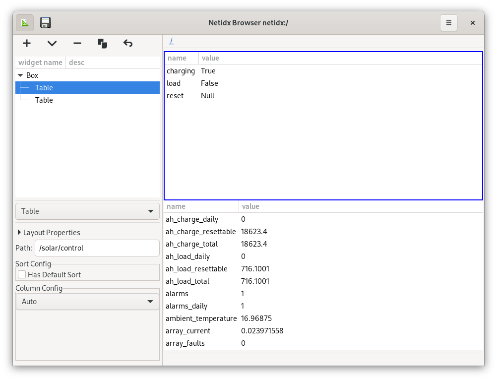
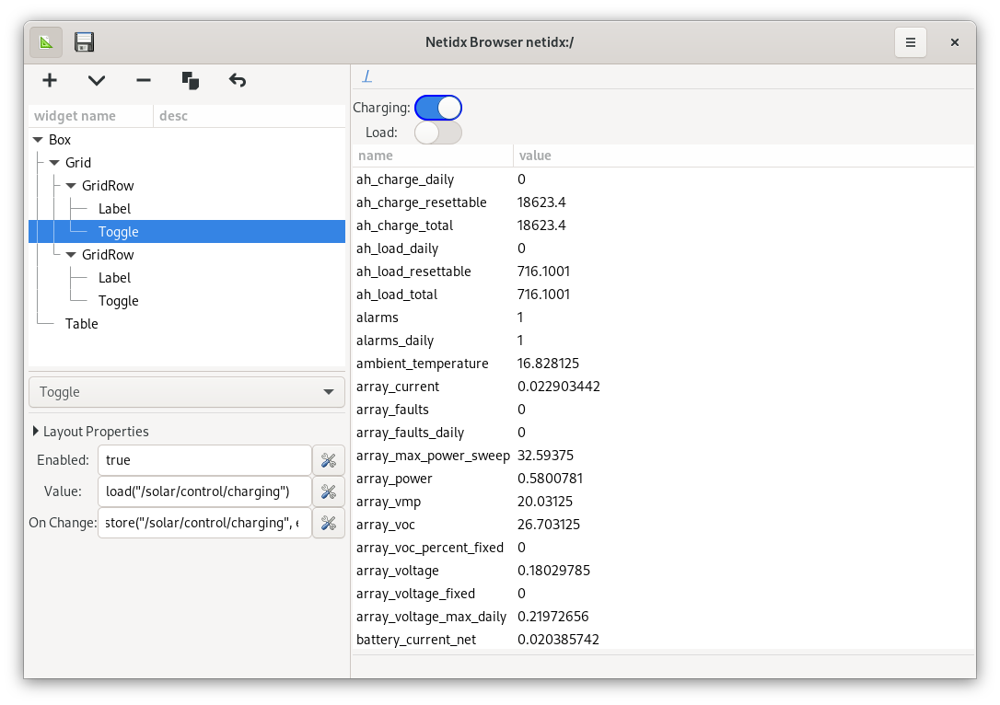

# Constructing Custom Views

Custom browser views are meant to fill the gap between full blown gui
apps that use netidx, and just tables. The goal is that it should be
possible to create moderately complex applications using custom
browser views and bscript (see [Clean Slate System
Design](./complete_system.md) for an example). The first step is to
enter design mode.

Design mode has 3 parts,

1. The widget tree. As the browser is based on Gtk+, this tree pretty
   much directly visualizes the Gtk+ widget tree. In Gtk+ layout is
   automatic, and is based on the structure of the widget tree, as
   such, you get the visual look you want for your app by manipulating
   this tree. You can drag and drop nodes around, and using the
   buttons just above the tree you can,
   - create a sibling of the currently selected node
   - create a child of the currently selected node
   - delete the currently selected node as well as all of it's children
   - duplicate the currently selected node as well as all of it's children
   - undo
2. This box displays the properties and controls of the currently
   selected widget, if any.
3. The content area; this displays the actual live gui as it is being
   built. The content area behaves exactly the same in design mode vs
   normal mode, and is fully interactive. It's entirely what you see
   is what you will get.

The normal default operation of the gui is in fact technically a
custom view, it is however automatically generated for each subtree if
no specific custom view is found for that subtree. The default
generated custom view is a table with the `Path` property set to the
path of the current subtree. For example, we can click on the table in
the widget tree to see the properties sheet.

There are several things about this worth pointing out.

- The widget selected in the widget tree will always be outlined in
  blue in the content area.
- The table widget has some configurable options that allow us to
  control column order, default sort, and which columns even appear.
- The layout properties expander is present on nearly every widget,
  and allows setting properties that all Gtk+ widets share.

## Our First Custom View

Now, lets make a custom view that displays 2 tables looking at
different subtrees at the same time. To do this, we need a container
widget to hold both tables, in Gtk+ we use a Box widget for this kind
of job. Since layout is procedural, we won't need to fiddle with
coordinates or anything like that, so it's very much like html, we
make a box, put some widgets into it, and let the toolkit figure out
how to make it look nice.

If you've used tools like Glade then this will be quite familiar to
you, except that the content are is completely live while the layout
is being designed. You can save the view you've designed by pressing
the disk icon in the header bar. This will allow you to save the view
definition in a file, or you can write it to a location in netidx.

If you write your custom view to a location in netidx that ends in
`.view`, e.g. `/solar/.view`, then when the browser is asked to
navigate to that subtree it will draw your view instead of the default
table.

## Toggle Buttons

Lets refine this little solar gui a bit, the top table takes up too
much space, and could be easier to interact with. There is a nice Gtk+
widget called a toggle that is great for both visualizing and
controlling boolean values.

We'd like the toggles and their labels to line up in nice neat columns
and rows, we could accomplish that with boxes, however Gtk+ has a grid
container widget that makes it much easier. We can also see our first
BScript looking at the properties of the first toggle button.

- enabled: This could be any expression, but in our case it's just the
  constant `true`, as this button is always enabled.
- value: `load("/solar/control/charging")` defines the value of the
  toggle button, it should evaluate to true or false. In this case we
  are loading the value directly from netidx. If the value in netidx
  changes, then the toggle button's state will change too.
- on change: `store("/solar/control/charging", event())` defines what
  happens when the user changes the state of the button. In this case
  we store the requested state of the button, which is `event()`, to
  the same path we loaded the value from. It's up to the publisher to
  decide whether the new requested state is actually valid right
  now. If it is, then it will update it's published value and the
  state of the toggle will reflect that.

We can test out if these buttons work without leaving design mode. We
can also use the expression inspector, by clicking the tool button
right next to the expression, to construct and debug more complex
expressions. Using that tool will be covered more in the next section
on BScript.
