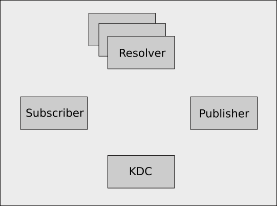
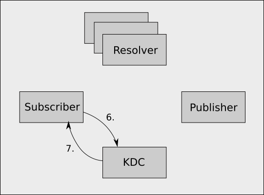
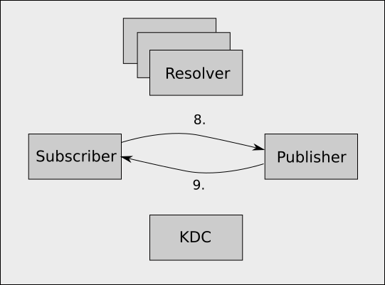

## Subscription Flow

Sometimes debugging problems requires a more detailed understanding of
exactly what steps are involved in a subscription.

### Components

In the full kerberos enabled version of netidx the following
components are involved.

* The Kerberos 5 KDC (Key Distribution Center). e.g. The AD Domain Controller.
* Resolver Cluster, holds the path of everything published and the
  address of the publisher publishing it.
* Subscriber
* Publisher, holds the actual data, and has previously told the
  resolver server about the path of all the data it has.

### Step 1

1. The Subscriber asks the KDC for a service ticket to talk to the
   Resolver Cluster. Note this only happens once for each user for
   some amount of time (usually hours), after which the service ticket
   is cached. The subscriber proves it's identity to the KDC using
   it's TGT.
2. The KDC, having checked the validity of the subscriber's identity,
   generates a service ticket for the resolver server cluster. NOTE,
   Kerberos does not make authorization decisions, it merely allows
   entities to prove to each other that they are who they claim to be.

### Step 2

3. The Subscriber uses the service ticket to establish an encrypted
   GSSAPI session with the Resolver Cluster.
4. Using the session it just established sends a resolve request for
   the paths it wants to subscribe to. All traffic is encrypted using
   the session.
5. The Resolver Cluster verifies the presented GSSAPI token and
   establishes a secure session, looks up the requested paths, and
   returns a number of things to the subscriber for each path.
   * The addresses of all the publishers who are publishing that path
   * The service principal names of those publishers
   * The permissions the subscriber has to the path
   * The authorization token, which is a SHA512 hash of the concatenation of
     * A secret shared by the Resolver Cluster and the Publisher
     * The path
     * The permissions

### Step 3

6. The subscriber picks a random publisher from the set of publishers
   publishing the path it wants, and requests a service ticket for
   that publisher's SPN from the KDC.
7. The KDC validates the subscriber's TGT and returns a service ticket
   for the requested SPN, which will be cached going forward (usually
   for several hours).

### Step 4

8. The subscriber uses the service ticket it just obtained to
   establish an encrypted GSSAPI session with the publisher, and using
   this session it sends a subscribe request, which consists of,
   * The path it wants to subscribe to
   * The permissions the resolver cluster gave to it
   * The authorization token
9. The publisher validates the subscriber's GSSAPI token and
   establishes an encrypted session, and then reads the subscribe
   request. It looks up the request path, and assuming it is
   publishing that path, it constructs a SHA512 hash value of,
   * The secret it shared with the resolver cluster when it initially
     published the path.
   * The path the subscriber is requesting
   * The permissions the subscriber claims to have 

   It then checks that it's constructed auth token matches the one the
   subscriber presented. Since the subscriber does not know the secret
   the publisher shared with the resolver server it is computationally
   infeasible for the subscriber to generate a valid hash value for an
   arbitrary path or permissions, therefore checking this hash is an
   effective proof that the resolver cluster really gave the
   subscriber the permissions it is claiming to have.

   Assuming all the authentication and authorization checks out, and
   the publisher actually publishes the requested value, it sends the
   current value back to the publisher along with the ID of the
   subscription.
   
   Whenever the value changes the publisher sends the new value along
   with the ID of the subscription to the publisher (encrypted using
   the GSSAPI session, and over the same TCP session that was
   established earlier).

In the case netidx is not configured to use kerberos the KDC is not
involved, and none of the authentication or authorization tokens are
established/sent, it's just a simple matter of look up the address
from the resolver, and then subscribe to the publisher. In that case
all data goes in the clear.

## Fault Tolerance

As a system netidx depends on fault tolerant strategies in the
subscriber, publisher, and resolver server in order to minimize
downtime caused by a failure. Before I talk about the specific
strategies used by each component I want to give a short taxonomy of
faults so I clearly talk about different classes.

- Hang: Where a component of the system is not 'dead', but is no
  longer responding, or is so slow it may as well not be
  responding. IMHO this is the worst kind of failure. It can happen at
  many different layers, e.g.
  - You can simulate a hang by sending SIGSTOP to a unix process. It
    isn't dead, but it also won't do anything.
  - A machine with a broken network card, such that most packets are
    rejected due to checsum errors, it's still on the network, but
    it's effective bandwidth is a tiny fraction of what it should be.
  - A software bug causing a deadlock
  - A malfunctioning IO device
- Crash: A process or the machine it's running on crashes cleanly and
  completely.
- Bug: A semantic bug in the system that causes an effective end to
  service.
- Misconfiguration: An error in the configuration of the system that
  causes it not to work. e.g.
  - Resolver server addresses that are routeable by some clients and not others
  - Wrong Kerberos SPNs
  - Misconfigured Kerberos

### Subscriber & Publisher

- Hang: Most hang situations are solved by heartbeats. Publisher sends
  a heartbeat to every subscriber that is connected to it every 5
  seconds. Subscriber disconnects if it doesn't reveive at least 1
  message every 100 seconds.

  Once a hang is detected it is dealt with by disconnecting, and it
  essentially becomes a crash.
  
  The hang case that heartbeats don't solve is when data is flowing,
  but not fast enough. This could have multiple causes e.g. the
  subscriber is too slow, the publisher is too slow, or the link
  between them is too slow. Whatever the cause, the publisher can
  handle this condition by providing a timeout to it's `flush`
  function. This will cause any subscriber that can't consume the
  flushed batch within the specified timeout to be disconnected.
- Crash: Subscriber allows the library user to decide how to deal with
  a publisher crash. If the lower level `subscribe` function is used
  then on being disconnected unexpecetedly by the publisher all
  subscriptions are notified and marked as dead. The library user is
  free to retry. The library user could also use `durable_subscribe`
  which will dilligently keep trying to resubscribe, with linear
  backoff, until it is successful. Regardless of whether you retry
  manually or use `durable_subscribe` each retry will go through the
  entire process again, so it will eventually try all the publishers
  publishing a value, and it will pick up any new publishers that
  appear in the resolver server.

### Resolver

- Hang: Resolver clients deal with a resolver server hang with a
  dynamically computed timeout based on the number of requests in the
  batch. The rule is, minimum timeout 15 seconds or 6 microseconds per
  operation in the batch for reads or 12 microseconds per operation in
  the batch for writes, whichever is longer. That timeout is a timeout
  to get an answer, not to finish the batch. Since the resolver server
  breaks large batches up into smaller ones, and answers each micro
  batch when it's done, the timeout should not usually be hit if the
  resolver is just very busy, since it will be sending back something
  periodically for each micro batch. The intent is for the timeout to
  trigger if the resolver is really hanging.
- Crash: Resolver clients deal with crashes differently depending on
  whether they are read or write connections.
  - Read Connections (Subscriber): Abandon the current connection, wait a random
    time between 1 and 4 seconds, and then go through the whole
    connection process again. That roughly entails taking the list of
    all servers, permuting it, and then connecting to each server in
    the list until one of them answers, says a proper hello, and
    successfully authenticates (if kerberos is on). For each batch a
    resolver client will do this abandon and reconnect dance 3 times,
    and then it will give up and return an error for that
    batch. Subsuquent batches will start over from the beginning. In a
    nutshell read clients will,
     - try every server 3 times in a random order
     - only give up on a batch if every server is down or unable to answer
     - remain in a good state to try new batches even if previous batches have failed
  - Write Connections (Publishers): Since write connections are
    responsible for replicating their data out to each resolver server
    they don't include some of the retry logic used in the read
    client. They do try to replicate each batch 3 times seperated by a
    1-4 second pause to each server in the cluster. If after 3 tries
    they still can't write to one of the servers then it is marked as
    degraded. The write client must send heartbeats periodically
    (configurable 1/2 writer_ttl), and it will try to replicate to a
    degraded server at each heartbeat interval. In a nutshell write clients,
     - try 3 times to write to each server
     - try failed servers again each 1/2 `writer_ttl`
     - never fail a batch, just log an error and keep trying next 1/2 `writer_ttl`

One important consequence of the write client behavior is that in the
event all the resolver servers crash, when they come back up
publishers will republishing everything after a maximum of 1/2
`writer_ttl` has elapsed.
